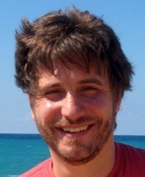

<pafilis@hcmr.gr> (<a href="https://orcid.org/0000-0001-5079-0125" target="_blank" aria-label="View ORCID record - 0000-0001-5079-0125">0000-0001-5079-0125
</a>)

## Research interests

With a background in data integration and literature text mining, I focus on uncovering and sharing knowledge within microbial ecology and biodiversity. Utilizing metadata processing and data visualization, I apply these methods across diverse use cases—from mapping associations among microorganisms, environments, and processes  ([PREGO](https://prego.hcmr.gr){:target="blank"}), to characterizing climate change-related studies ([CCMRI](https://ccmri.hcmr.gr){:target="blank"}), and creating tools for interactive, spatial molecular biodiversity exploration ([Odyssey](https://biodataanalysisgroup.github.io/ELIXIR-BFSP-Odyssey/){:target="blank"}).

Leveraging Artificial Intelligence/Large Language Models (LLMs), while bridging these with traditional method skills/processes, drive our current lab efforts.

On the side, I enjoy teaching the Linux operating system, training the next generation of bioinformaticians, organizing citizen-science [sampling and analysing soil samples around Crete](https://genomicsstandardsconsortium.github.io/isd-crete-website){:target="blank"}, cycling, and taking pictures. 

## Brief CV

* Researcher in Bioinformatics and Biodiversity informatics (2018-present)
* Postdoctoral Researcher (2011), Hellenic Center for Marine Research, Institute of Marine Biology Biotechnology and Aquaculture
* Postdoctoral Researcher (2009), Medical School, University of Crete
* PhD in Bionformatics (2009), EMBL - University of Heidelberg
* MRes in Bioinfomatics (2003), University of Glasgow  
* BSc in Biology (2002), University of Crete  

## Awards and scientific challenges

* [Biocreative V (2015): interactive annotation task](https://biocreative.bioinformatics.udel.edu/tasks/biocreative-v/iat-task-biocurators/), top performance by the [EXTRACT](http://extract.hcmr.gr) metadata annotation system 
* Encyclopedia of Life Rubenstein Fellowship (2013)
* Elsevier grand challenge (2009): knowledge enhancement in the life sciences, as a member of the Reflect team 

## Other profile links

* [Google Scholar](https://scholar.google.com/citations?user=Aik8EvoAAAAJ&hl=en)
* [Twitter](https://twitter.com/epafilis)
