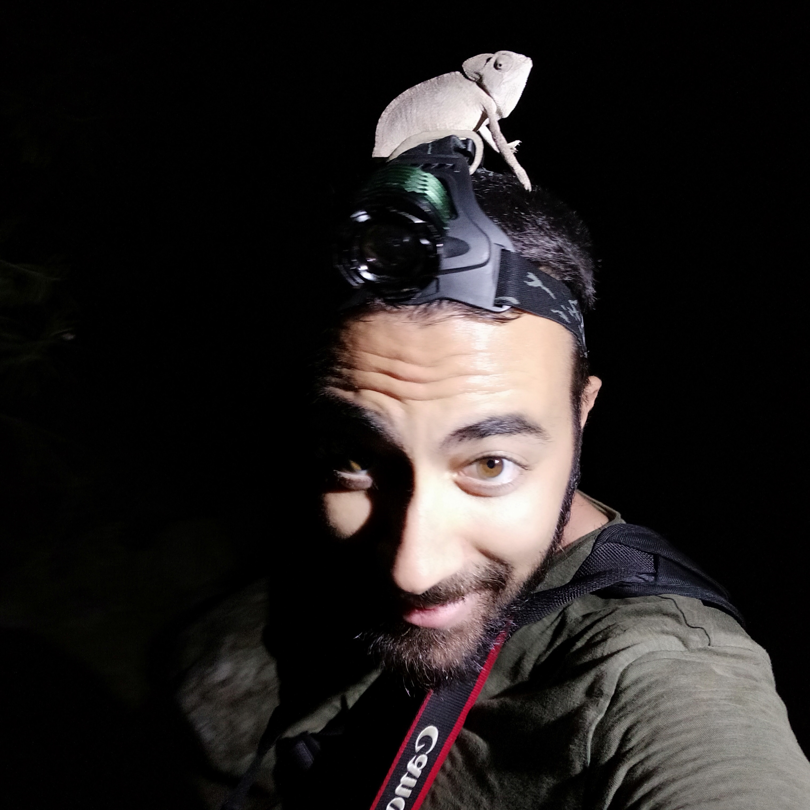

## Research interests

My research interests include phylogenomics, biological invasions, bioinformatics. 

I joined the Lab in May 2024 to participate in the project [CCMRI](http://ccmri.hcmr.gr/) which aims to harvest the metagenomic records pertaining to Climate Change and offer researchers with a web-based notification service when relevant records become available.

## Brief CV

#### May 2023 - present

  * Corpus Curator of the Climate Change Metagenomic Record Index ([CCMRI](http://ccmri.hcmr.gr/)) project in Institute of Marine Biology, Biotechnology and Aquaculture (IMBBC) - Heraklion, Greece 

  
#### April 2023 - present

  * PhD Student in Aristotle University of Thessaloniki focusing on large-scale DNA Barcoding of understudied insect taxa in Greece. - Thessaloniki, Greece 

#### Jun 2022 - Apr 2023

  * Research assistant in Hydrobiological Station of Rhodes (HCMR) researching biological invasions, marine megafauna protection, setting up a citizen-science database. - Rhodes, Greece 
  
  
#### Sep 2019 - Aug 2021
  * MSc (Hons) in Molecular Genetics & Biotechnology, Leiden University & Naturalis Biodiversity Center. - Leiden, The Netherlands
 
    MSc Research Theses:
    - Hybrid zone analysis of banded newts (genus Ommatotriton) based on KASP genotyping.
    - Phylogenomic analysis of banded newt phylogeny (genus Ommatotriton) using target enrichment by sequence-capture.

  
#### Noe 2018 - May 2019
  * Military Service in Military Hospital of Rhodes - Rhodes, Greece
 

#### Apr 2018 - Jun 2018
  * Erasmus Placement in Conservation Genetics in WildGenes (Royal Zoological Society of Scotland) - Edinburgh, Scotland

  
#### Jun 2017 - Aug 2017
  * Internship in Broodstock Management in Dr. Mylonas' Lab (IMMBC, HCMR) - Heraklion, Greece

#### Sep 2013 - Mar 2018
  * BSc (Hons) in Biology, Aristotle University of Thessaloniki. - Thessaloniki, Greece
 
    BSc Research Thesis:
    - Phylogenetic analysis of European populations of the grey partridge (Perdix perdix) using mitochondrial markers.
  
 
## Publications
[Researchgate](https://www.researchgate.net/profile/Konstantinos-Kalaentzis)
[Google Scholar](https://scholar.google.gr/citations?user=0zOE4YQAAAAJ&hl=en)

## Contact
<k.kalaentzis@hcmr.gr>
