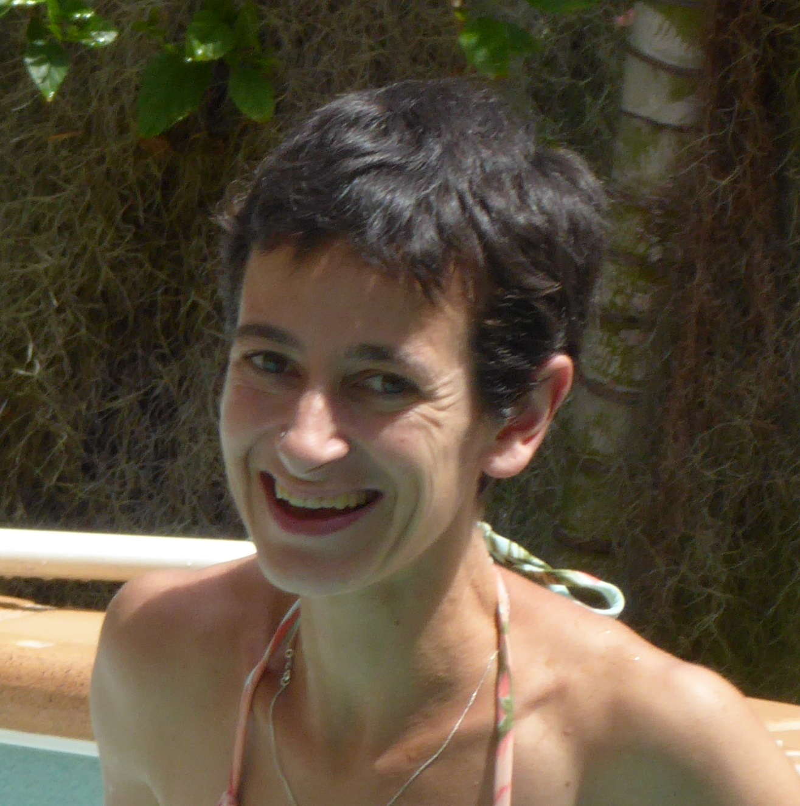

## Research interests
My background is ethology and animal ecology, mostly applied to the study of sandy beaches, and hands-on experience worldwide. Am currently applying the knowledge gained to the extraction of relevant indicators of change both in the ecological and social templates related to sandy beaches. Needless to say, the issue of plastic litter became more and more integrated in my research. In this respect, I have been acting as scientific responsible for projects at the interface between science and society.
I currently focus on the identification of proper analytical scales to address impacts on sandy shores, and on data communication to different audiences.

## Brief CV
[link to detailed publication listing](#detaild-publication-listing)
* Postdoctoral researcher (2021)
* Self employed (2017)
* AMRI research associate (2016)
* Postdoctoral Researcher (2011-2013), Hellenic Center for Marine Research, Institute of Marine Biology Biotechnology and Aquaculture
* UY research associate (2015)
* Postdoctoral Researcher (2007), University of Florence, Italy
* PhD in Ethology and Animal Ecology), University of Florence, Italy
* MSc in Ecology (2002), University of Florence, Italy

## Awards
* 2019 Eklipse (Knowledge and Learning Mechanism on Biodiversity and Ecosystem Services)-EUH2020call for capacity building event. Selected and granted participation to “Plastics in our Ocean micro or macro challenge” organised by CIC-Nanogune (1-2/10/2019, San Sebastiàn, Spain).
* 2018 Sponsorship (in kind) to the students’ awards by the brand TerraNation(beach gear retailers) for the ISBS2018
* 2010 The Journal of Experimental Biology and the Company of Biologists LtD. Grant for the project “Turtle tracks on the sand: Straightness as a proxy of nesting site search patterns” in collaboration with Dr. E.A. Cuevas, Pronatura Yucatàn S.C., Mexico.
* 2010 2nd prize APRE (Agency for the Promotion of European Research, Italy) “Science Communication” for the French-Arabic bilingual book for children “Aventure au Royaume des Amphibiens et des Reptiles”.
* 2008 Synthesys grant for the project “Investigating the links between environmental stability and sandhopper behaviour: the case-study of oued Ghrifa river mouth, Morocco”) in collaboration with Dr. Oliver Coleman, Museum fűr Naturkunde Berlin, Germany.

## Invitations
* 2020 Invited presentation "Current status and challenges of coastal systems - a social-ecological perspective" Leuphana University Lüneburg, Faculty of Sustainability (DE).
* 2019 Invited presentation “Ecology of sandy beaches – where we are, where do we want to go”, University of Rennes1, Beaulieu campus, France
* 2018 and 26-27/03/2019. Invited to the workshop Monaco Ocean Week as BEMED 2018 laureate for the project “Networking against plastic pollution”.
* 2018 Invited speaker to the event “Prevent Plastic in the Mediterranean Sea” and Annual General Meeting by Cyprus Sustainable Tourism Initiative (Limassol, Cyprus).
* 2014 “Beach science talk” Scotland Island (NSW, Australia) organised by the Scotland Island Residents Association to present the experiment that was running on the island.
* 2012 Invited expert to give a theoretical-practical course on “Estimating the Potential Impacts of Climate Change on Biodiversity” at the University of Alexandria, Egypt. The 3-days course was part of the activities of the Alexandria Research Centre for Adaptation, funded by the International Development Research Center (Canada).
* 2009 Symposium organised by the Chamber of Commerce of Alexandria “Selected Environmental Issues in the Mediterranean Region”, Alexandria, Egypt, talk on environmental policies in the Mediterranean (mixed audience, including policy-makers, companies, academics).

## Other profile links
* [ResearchGate](https://www.researchgate.net/profile/Lucia_Fanini) 

# Detaild Publication Listing 

ORCID ID [0000-0003-2301-2576](https://orcid.org/0000-0003-2301-2576)

I authored 40 papers in peer-reviewed journals, as leading –first or last- author in more than 50% of them, with and without previous supervisors. Scopus h-index = 14; h =12 excluding self-citations [Information retrieved December 2020]. Conference proceedings, reports, outreach articles and BeMed material (blog posts and activity templates) are excluded from the list of publications attached, though are available through ResearchGate. Overall, published papers include more than 100 co-authors and 70 different institutions, as well as different research disciplines. 
* [40] Riechers M, Fanini L, Viana-Silva A, Apicella A, Espiña B, Batista Galván C, Blondel E, Ronchi F, Sardon H, García-Morales I M, Klun K, Stulgis M, Ruiz Rodríguez P A, Schmuck S A, Kefer S, Pereira T, Keroullé T, Ibarra-Gonzalez N, Microplastics in our ocean as a transdisciplinary challenge: Lessons from a co-learning workshop (in press), Marine Pollution Bulletin
* [39] Fanini L, Piscart C, Pranzini E, Kerbiriou C, Le Viol I , Pétillon J. The extended concept of Littoral Active Zone considering soft sediment shores as social-ecological systems, and an application to Brittany (North-Western France) (in press, Estuarine Coastal and Shelf Science)
* [38] Costa LL, Zalmon IR, Fanini L, Defeo O (2020). Macroinvertebrates as indicators of human disturbances on sandy beaches: a review. Ecol Indic118, p.106764
* [37] Fanini L, Defeo O, Elliott M (2020). Advances in sandy beach research-Local and global perspectives. Estuar Coastal Shelf S, 234, p.106646.
* [36] Giangrande A, Gambino I, Tundo M, del Pasqua M, Licciano M, Fanini L, Pinna M (2020). Biology of Ophelia barquii (Anellida, Opheliidae) colonizing two different beaches along Salento peninsula (South Italy, Mediterranean sea), Mar. Biodivers. 50,3.
* [35] Fanini L, Coleman CO, Lowry JK. (2019) Insights into the ecology of Cryptorchestia garbinii on the shores of the urban lake Tegel (Berlin, Germany), Vie Milieu 69: 187-191.
* [34] Fanini L, Plaiti W, Papageorgiou N (2019) Environmental education: Constraints and potential as seen by sandy beach researchers. Estuar Coast Shelf S 218: 173-178.
* [33] Fanini L, Bozzeda F (2018) Dynamics of plastic resin pellets deposition on a microtidal sandy beach: informative variables and potential integration into sandy beach studies. Ecol Indic 89: 309-316.
* [32] Scapini F, Gambineri S, Fanini L (2018) Deconstructing responses of sandy beach arthropodofauna to shoreline erosion: looking for the proper spatial scale to monitor biodiversity. J Coast Conserv 22: 369-383.
* [31] Fanini L, Zampicinini G, Tsigenopoulos CS, Barboza FR, Lozoya JP, Gómez J, Celentano E, Lercari D, Marchetti GM, Defeo O (2017) Life-history, substrate choice and Cytochrome Oxidase I variations in sandy beach peracaridans along the Rio de la Plata estuary. Estuar Coast Shelf S 187: 152-159.
* [30] Mavraki D, Fanini L, Tsompanou M, Gerovasiliou V, Nikolopolou S, Chatzinikolau E, Plaitis W, Faulwetter S (2016) Rescuing biogeographic legacy data: The “Thor” expedition, a historical oceanographic expedition to the Mediterranean Sea. Biodiv Data J 4: e11054.
* [29] Vasileiadou K, Pavloudi C, Kalantzi I, Apostolaki E, Chatzigeorgiou G, Chatzinikolaou E, Pafilis E, Papageorgiou N, Fanini L, Konstas S, Fragopoulou N, Arvanitidis C (2016) Environmental variability and heavy metal concentrations from five lagoons in the Ionian Sea (Amvrakikos Gulf, W Greece). Biodiv Data J 4: e8233.
* [28] Faulwetter S, Pafilis E, Fanini L, Bailly N, Agosti D, Arvanitidis C, Boicenco L, Capatano T, Claus S, Dekeyzer S, Georgiev T, Legaki A, Mavraki D, Oulas A, Papastefanou G, Penev L, Sautter G, Schigel D, Senderov V, Teaca A, Tsompanou M. (2016). EMODnet Workshop on mechanisms and guidelines to mobilise historical data into biogeographic databases. Research Ideas and Outcomes 2: e9774
* [27] Fanini L, Hughes L E, Springthorpe R, Tosetto L, Lowry J K. (2016). Surface activity patterns of macrofauna on pocket, tidal beaches: Insights into the role of wrack and artificial lighting. Reg Stud Mar Sci 7: 63-71.
* [26] Fanini L, Lowry JK. (2016). Comparing methods used in estimating biodiversity on sandy beaches: Pitfall vs. quadrat sampling. Ecol Indic 60: 358 – 366.
* [25] Pafilis E, Frankild SP, Schnetzer J, Fanini L, Faulwetter S, Pavloudi C, Vasileiadou A, Leary P, Hammock J, Schulz K, Parr CS, Arvanitidis C, Jensen LJ (2015). ENVIRONMENTS and EOL: identification of environment ontology terms in text and the annotation of the encyclopedia of life. Bioinformatics 31(11).
* [24] Scapini F, Gambineri S, Rossano C, Elgtari M, Fanini L, Nourisson DH (2015). Talitrid orientation as bioindicator of shoreline stability: Protected headlands versus exposed extended beaches. Ecol Indic 53: 28-36.
* [23] Faulwetter S, Papageorgiou N, Koulouri P, Fanini L, Chatzinikolau E, Markantonatou V, Pavloudi C, Chatzigeorgiou G, Keklikoglou K, Vasileiadou K, Basset A, Pinna M, Rosati I, Reizopoulou S, Nicolaidou A, Arvanitidis C (2014). Resistance of polychaete species and trait patterns to simulated species loss in coastal lagoons. J Sea Res 98: 73-82.
* [22] Fanini L, Lowry JK (2014). Coastal talitrids and connectivity between beaches: A behavioural test. J Exp Mar Biol Ecol 457:120-127.
* [21] Fanini L, Longo S, Cervo R, Roversi PF, Mazza G (2014). Daily activity and non-random occurrence of captures in the Asian palm weevils. Ethol Ecol Evol 26: 195-203.
* [20] Faulwetter S, Markantonatou V, Pavloudi C, Papageorgiou N, Keklikoglou K, Chatzinikolau E, Pafilis E, Chatzigeorgiou G, Vasileiadou K, Dailianis T, Fanini L, Koulouri P, Arvanitidis C (2014). Polytraits: A database on biological traits of marine polychaetes. Biodiv Data J 2: e1024
* [19] Fanini L, Zampicinini G, Pafilis E (2013). Beach parties: a case study on recreational human use of the beach and its effects on mobile arthropod fauna. Ethol Ecol Evol 26:69-79.
* [18] Lowry JK, Fanini L (2013). Substrate dependent talitrid amphipods from fragmented beaches on the north coast of Crete (Crustacea, Amphipoda, Talitridae), including a redefinition of the genus Orchestia and descriptions of Orchestia xylino sp. nov. and Cryptorchestia gen. nov. Zootaxa 3709: 201-229.
* [17] Scapini F, Fanini L, Gambineri S, Nourisson DH, Rossano C (2013). Monitoring changes of sandy beaches in temperate areas through sandhoppers’ adaptations. Crustaceana 86: 932-954.
* [16] Pafilis E, Frankild SP, Fanini L, Faulwetter S, Pavloudi C, Vasileiadou A, Arvanitidis C, Jensen LJ (2013). The SPECIES and ORGANISMS resources for fast and accurate identification of taxonomic names in text. PlosOne 8:e65390.
* [15] Fanini L, Gecchele LV, Gambineri S, Bayed A, Coleman CO, Scapini F (2012) Behavioural similarities in different species of sandhoppers inhabiting transient environments, J Exp Mar Biol Ecol 420-421: 8-15.
* [14] Fanini L, Marchetti GM, Baczewska A, Sztybor K, Scapini F (2012). Behavioural adaptation to different salinities inTalitrus saltator: Mediterranean vs. Baltic beaches, Mar Freshw Res 63: 275-281.
* [13] Fanini L (2011). Animal Navigation in the classroom: Lessons from a pilot experience, App Env Educ Comm 10:178-187.
* [12] Arvanitidis C, Faulwetter S, Chatzigeorgiou G, Penev L, Bankí O, Dailianis T, Pafilis E, Kouratoras M, Chatzinikolaou E, Fanini L et al.(2011). Engaging the broader community in biodiversity research: the concept of the COMBER pilot project for divers in ViBRANT. Zookeys 150:211–229.
* [11] Ketmaier V, De Matthaeis E, Fanini L, Rossano C, Scapini F (2010). Beach dynamics have an impact on the variation of genetic and behavioral traits in the sandhopperTalitrus saltator (Crustacea, Amphipoda): a study case in southern Tuscany Ethol Ecol Evol 22: 17-35.
* [10] Fanini L, Defeo O, Do Santos C, Scapini F (2009). Testing the Habitat Safety Hypothesis with behavioural field experiments: amphipod orientation on sandy beaches with contrasting morphodynamics, Mar Ecol Prog Ser 392:133-14.
* [9] Rossano C, Gambineri S, Fanini L, Durier V, Rivault C, Scapini F (2009). Behavioural adaptations in talitrids from two Atlantic beaches, Estuar Coast Shelf S 85:573-584.
* [8] Fanini L, Marchetti G M, Scapini F, Defeo O (2009). Effects of beach nourishment and groynes building on population and community descriptors of mobile arthropodofauna, Ecol Indic 9:167-178.
* [7] Fanini L, Fahd S (2009). Storytelling and environmental information: Connecting schoolchildren and herpetofauna in Morocco. Integr Zool 4:178-185.
* [6] Fanini L, Scapini F (2008). Variable orientation within a natural population of sandhopper Talitrus saltator (Crustacea:Amphipoda) as response to a variable environment. The case-study of Berkoukesh beach, Tunisia. Estuar Coast Shelf S 77: 163-168.
* [5] Gambineri S, Rossano C, Durier V, Fanini L, Rivault C, Scapini F (2008). Orientation of littoral amphipods in two sandy beaches of Brittany (France) with wide tidal excursions.Chemistry Ecol 24:129-144.
* [4] Fanini L, ElGtari M, Ghlala A, ElGtari-Chaabkane T, Scapini F (2007). From researchers to primary school: dissemination of scientific results on the beach. An experience of environmental education at Nefza, Tunisia. Oceanologia 49: 145-157.
* [3] Fanini L, Marchetti GM, Scapini F, Defeo O (2007).Abundance and orientation responses of the sandhopperTalitrus saltator to beach nourishment and groynes building at San Rossore Regional Park, Tuscany, Italy, Mar Biol 152:1169-1179.
* [2] Fanini L, Martìn Cantarino C, Scapini F (2005). Relationships between the dynamics of two Talitrus saltator populations and the impacts of activities linked to tourism. Oceanologia 47: 93-112.
* [1] Scapini F, Chelazzi L, Colombini I, Fallaci M, Fanini L(2005). Orientation of sandhoppers at different points along a dynamic shoreline in southern Tuscany, Mar Biol 147: 919-926.

## Chapters in collective volumes and books
* [1] Fanini L, 2010. Chapter 3 “Integration of gender dimension in the socioeconomic analysis”, in “About Coastal Water Bodies – Nature and Culture Conflicts in the Mediterranean”, Scapini F & Ciampi G editors, Springer
* [2] Fahd S, Bertelli L, Raihani Y, Fanini L, Oumoussa A, 2008. Bilingual (arabic-french) children book “Aventure au Royaume des Amphibiens et des Reptiles” [Adventure to the Kingdom of Amphibians and Reptiles], tipografia Bertelli ed., Florence.
* [3] Massolo A, Fanini L, Ammannati M, Bencini C, 2008. Didactic book for students of Psychology “Biologia” [Biology], series Progress test, EDISES.
* [4] Fanini L, 2007. I visitatori del Parco Regionale della Maremma [The visitors of the Maremma Regional Park], chapter of the touristic guide “Il Parco Regionale della Maremma: una guida per conoscere e capire” [The Maremma Regional Park: a guide to know and understand], Pacini ed.

## Guest editing of Special Virtual Issues 
* Marine Pollution Bulletin (SVI title "Marine Litter: experiences and perspectives towards the UN decade of Ocean Science for Sustainable Development 2021-2030" opening October 2020-ongoing).
* Estuarine Coastal and Shelf Science (SVI title "Sandy beaches: Linking knowledge to build integrated paradigms and face global change challenges" opened September 2018 - March 2020).
